# PART 1 Non-parametric Test 第一部分 非参数检验

## 一.Compare distributions 比较样本的分布

### ①单样本非参数检验

#### (1)Chi-square test卡方检验

##### 1.卡方拟合优度检验

用于将 \*\* 观测频数（观测分布）与期望频数（期望分布）\*\* 进行比较。\
*H0：观测频数与期望频数无显著差异。\
*用于判断：由原假设设定的总体分布（任意分布！），与实际得到的样本分布的拟合优度（契合程度）。\
无需对总体分布做任何假设，因此属于非参数检验，也叫无模型检验。

```{r}
# Goodness-of-fit test
# example：major reason to choose a course举个例子：选课的主要原因，我们假设选课概率是相等的，服从均匀分布

rm(list = ls())#用于把现有工作台给删了，防止结果加载不出来不用管
# actual frequencies（向量）
f_o = c(18, 17, 7, 8)

# expected frequencies(normalized)理论上的分布
prob = rep(1/length(f_o), length(f_o)) # uniform

# Conduct the test实施检测
chisq.test(f_o, p = prob)#简单的算
chisq.test(f_o, correct = T, p = prob)#chi squra goodness of fitness
chisq.test(f_o, y = NULL, correct = F, p = prob, rescale.p = F)

# Let's try some new expected frequencies尝试些别的
prob = c(4,3,2,1)

# Conduct the test
# turn the rescale option to 'T' to normalize p
chisq.test(f_o, p = prob, rescale.p = T)

#核心函数就是chisq.test(被测数据,correct=是否连续矫正，p=理论分布)
#同时点击ctrl+alt+r运行，运行结果如下

```

##### 2.卡方独立性检验（Chi-square test for independence），

专门用来判断两个分类变量之间是否存在关联（是否相互独立），比如这张图里的问题:\
父母的育儿方式和政治立场有没有关系。\
 数据必须以列联表（矩阵）形式呈现，每个单元格是分类频数，不能是连续的等距 \\ 等比数据。\
*H₀：两个变量相互独立（无关联）；*\
*H₁：两个变量不独立（存在关联）*

```{r}
# Independence test
# example：the relationship between child rearing and political orientation (contingency table)
#父母的两种政治立场和两种管教方式之间的关系

# Create data
data1 <- data.frame(c(15,10),c(5,10))

# Conduct the test
test_result <- chisq.test(data1, correct = F)#注意这个是2*2，所以是F

# Extract the chi-squared statistic
chi_square <- test_result$statistic

# Calculate the total sample size
n <- sum(data1)# 计算总样本量 n = 15+10+5+10 = 40

# Determine the minimum of rows and columns
k <- min(dim(data1))# 取行数和列数的最小值。2×2表，k=2

# 算 Cramer's φ
cramer_phi <- sqrt(chi_square / (n * (k - 1)))

# Print the result
test_result
cat("Cramer's φ: ", cramer_phi, "\n")
#因为这是2*2列联表，所以未进行连续性校正（correct = FALSE）
```

#### (2) Binomial test 二项检验：检验数据是否符合二项分布

二项分布（Binomial Distribution）描述的是 n 次独立重复伯努利试验中，\
成功次数 X 的概率分布，每次试验只有 “成功 \\ 失败” 两种互斥结果，且成功概率 p 固定不变。\
它只由两个参数决定：试验总次数 n（总 trials 数）和单次成功概率 p（0 \< p \< 1），记为 X∼B(n,p)。\
专门用于只有两种结果的分类数据，比如抛硬币正反面、博彩任务选 A\\B、问卷选是 \\ 否，\
完全不依赖正态分布等参数假设，是典型的非参数精确检验。\
*原假设 H0​：真实成功概率 p=p0​*\

```{r}
# example: to test whether the subject is guessing during a gamble task
#举例子：去检验一个几十次的博彩任务是否随机
binom.test(x = 15, # the trials choosing option 1选1的情况
           n = 31,  # the total trials总次数
           p = .5,  # H0:the probability of success is equal to 0.5
           alternative='two.sided') 
#number of successes = 15, number of trials = 31	就是15 次成功，31 次总试次


```

#### (3) Runs test 游程检验（注意算一个值的游程和另一个值的游程相加是总游程）

*看二项过程是不是随机产生*

游程检验是用于检验二分类序列是否为随机序列的非参数检验，核心通过统计连续相同符号的“游程”数量，判断序列是否存在非随机规律。\
它不依赖数据的分布形态，仅基于序列的顺序和符号分类，是检验时间序列、二项过程随机性的经典方法。\
游程数量过多或过少，都意味着序列存在非随机模式：游程过少代表序列存在聚类趋势，游程过多代表序列存在交替趋势。\
其原假设为序列是随机产生的，备择假设为序列非随机，\
通过比较实际游程数与理论期望游程数的差异计算p值。\
该检验适用于二分类数据的随机性检验，如博彩任务选择、抛硬币序列、时间序列的趋势检验等场景。

```{r}
#其实什么包的不用太管，考试的话全给你安装了，
#平时想不起来先运行了等它报错就自己告诉你了。
#可能为数不多比较坑的地方就是很少有时候是由重名的函数的，特别是环境里函数一多就容易混
#这个时候就要对应的包::你要的函数()这样强制引用以下，但问题也不大
# Check if the package was already installed
# 检查haven包是否已安装，未安装则自动安装（用于读取SPSS的.sav格式数据）
if (!requireNamespace("haven", quietly = TRUE)) {
  install.packages('haven')
}
# 检查DescTools包是否已安装，未安装则自动安装（用于执行游程检验）
if (!requireNamespace("DescTools", quietly = TRUE)) {
  install.packages('DescTools')
}

# Load the package used to read .sav data
# 加载haven包，用于读取SPSS数据文件
library(haven)
# 读取指定路径的.sav数据文件，将数据存入runs_data变量
runs_data <- read_sav("../data/sav_files/Data12-04.sav")  

# Load the package used to conduct the test
# 加载DescTools包，该包提供了RunsTest()函数用于游程检验
library(DescTools)

# 对runs_data的第1列数据执行游程检验（注意函数名RunsTest大小写敏感）
DescTools::RunsTest(runs_data[[1]],
         alternative = 'two.sided',  # 双侧检验：检验实际游程数≠期望游程数（即序列非随机）
         exact = T)  # 计算精确p值（小样本推荐使用，大样本可设为F使用正态近似）
```

#### (4) K-S test

K-S 检验是基于经验累积分布函数（ECDF）的非参数检验，分为单样本和两样本两种形式，核心通过比较两个分布的累积分布函数的最大垂直距离（D 统计量），判断分布是否存在显著差异。\
**单样本 K-S 检验**用于检验单个样本是否服从某一理论分布（如正态分布），\
**两样本 K-S 检验**用于检验两个独立样本是否来自同一总体分布。它不依赖总体参数假设，对分布的位置、形状、偏态等差异都敏感，是检验分布拟合优度和两样本分布一致性的经典方法。\
其原假设为两个分布完全相同，备择假设为分布存在差异，通过 D 统计量和 p 值判断是否拒绝原假设，D值越大、p值越小，分布差异越显著。\
该检验适用于连续型数据的分布检验，对ties（相同值）敏感，单样本检验中存在 ties 会影响 p 值准确性，需注意数据预处理。\

(3)**游程检验Runstest**

作用:检验二项过程是不是随机产生\
概括结果中只有AB两类,连续的A的一段算A的一次游程,把A和B的游程数加起来得到总游程(如果是连续变量可以按照中位数二值化)\
*H0:序列是随机的,即类别出现顺序无规律,游程数符合随机分布*

```{r}
# example: to test whether the sample distribution is different from the normal distribution
# 示例：检验样本分布是否与正态分布存在差异

# Check if the package was already installed
# 检查haven包是否已安装，未安装则自动安装（用于读取SPSS的.sav格式数据）
if (!requireNamespace("haven", quietly = TRUE)) {
  install.packages('haven')
}

# Load the package used to read .sav data
# 加载haven包，用于读取SPSS数据文件
library(haven)

# 读取指定路径的.sav数据文件，将数据存入ks_data变量
ks_data <- read_sav("../data/sav_files/Data12-05.sav")
# 查看数据前6行，快速预览数据结构
head(ks_data)
# 查看数据的详细结构（变量类型、长度等）
str(ks_data)

# create a normal distribution based on the data
# 基于样本数据的均值和标准差，生成一个同参数的正态分布随机数（用于两样本K-S检验）
# length(ks_data$zd)：样本量，mean(ks_data$zd)：样本均值，sd(ks_data$zd)：样本标准差
norm0 = rnorm(length(ks_data$zd),mean(ks_data$zd),sd(ks_data$zd)) 

# conduct the test
# 1. 两样本K-S检验：比较样本数据ks_data$zd 与 生成的正态分布数据norm0的分布是否一致
ks.test(ks_data$zd, norm0)

# 2. 单样本K-S检验：直接检验样本数据ks_data$zd 是否服从指定参数的正态分布（pnorm为正态分布的累积分布函数）
# mean和sd指定理论正态分布的参数，与样本均值、标准差一致
ks.test(ks_data$zd, "pnorm", mean = mean(ks_data$zd), sd = sd(ks_data$zd))


#ks.test(观测值,”理论分布函数”,分布参数1=值1,分布参数2=值2)
#理论正态:”pnorm”,mean,sd（后面是理论分布需要的分布参数）
#理论均匀:”punif”,min,max
#理论指数分布:”pexp”,rate
#对数正态:”plnorm”,meanlog,sdlog


#首先看数据结构：ks_data$zd是一个包含 2608 个数值的变量，
#其中存在大量0值（即ties，相同观测值），这是警告的来源。

#第一个ks.test(ks_data$zd, norm0)是*两样本* K-S 检验，输出提示 “并列的时候P值将近似”，这是因为两样本中存在相同值（ties），R 会使用近似方法计算 p 值。

#第二个ks.test(ks_data$zd, "pnorm", mean = mean(ks_data$zd), sd = sd(ks_data$zd))
#是单样本 K-S 检验，有输出警告 “ties should not be present for the one-sample Kolmogorov-Smirnov test”，
#这是因为单样本 K-S检验的理论假设是数据为连续型、无重复值，而样本中存在大量 0 值（ties），
#违反了检验假设，因此 R 给出警告，p 值同样为近似计算。
```

### *②Non-parametric Test II双样本非参数检验*

#### (1).Two paired sample配对样本检验

##### 1.Sign test

\
*作用:检测配对数据是否存在显著差异,只在意差异的方向\
H0:配对数据没有显著差异 原理是配对数据互相减,看符号 是0会删掉,然后用二项分布算概率*

```{r}
# Check if the package was already installed
if (!requireNamespace("BSDA", quietly = TRUE)) {
  install.packages('BSDA')
}
# Load the package
library(BSDA)
# Pre-train scores
pre <- c(70, 62, 88, 68, 81, 84, 64, 86, 27, 76)
# Post-train scores
post <- c(80, 86, 77, 73, 91, 81, 72, 89, 72, 79)

# Conduct the test
SIGN.test(pre, post, alternative="two.sided")
#SIGN.test(pre,post,alternative=”two.sided”)
#前两位放配对数据
#p>0.05不拒绝H0

```

##### 2. Wilcoxon T test

WilcoxonTtest 基于*差值的绝对值*进行秩次排序,得到统计量T(正差值和负差值中较小的) 比上面的的更适合极端值少的,比较对称的分布

*作用:看两组数据是否有显著的差异*

*H0:正秩和负秩和相等\\两个东西没什么区别*

```{r}
# Check if the package was already installed
if (!requireNamespace("haven", quietly = TRUE)) {
  install.packages('haven')
}
# Load the package used to read .sav data
library(haven)
# Load data
two_related_samples <- read_sav("../data/sav_files/Data12-08.sav")

# Conduct wilcoxon t test
wilcox.test(x = two_related_samples$dlq, y = two_related_samples$dlh, 
            alternative = "two.sided",
            paired = T, exact = F, correct = F)
#wilcox.test(x=第一组数据,y=第二组数据,
#alternative="two.sided",
#paired=T,#写T就是配对样本检验,写F就MWU检验
#exact=F,correct=F)
#跟上面的比一下其实SIGNtest不太好使


# Let's see the comparison with sign test
SIGN.test(x = two_related_samples$dlq, y = two_related_samples$dlh,
          alternative = "two.sided")
```

##### 3. McNemar test

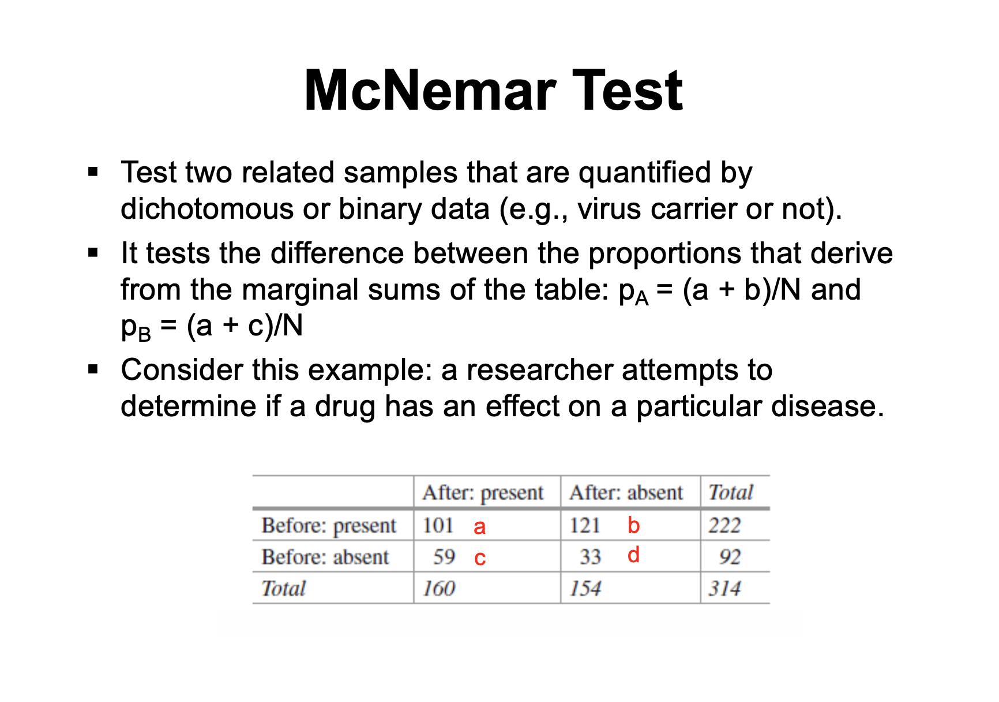{width="440"}

*作用:检验配对\\相关样本的二分类数据差异*

算比例差异pA=(a+b)\\NandpB=(a+c)\\N(2\*2列联表)

注意r是默认按列填充的,竖着第一,竖着第二,竖着完了轮到第二列

```{r}
# Create the data
drug_effect <-
matrix(c(101, 59, 121, 33),
       nrow = 2,
       dimnames = list("before" = c("present", "absent"),
                       "after" = c("present", "absent")))
#怎么构建矩阵？matrix(数据向量,nrow=行数,dimnames=list(行名,列名))
#注意r是默认按列填充的,竖着第一,竖着第二,竖着完了轮到第二列
#看第一个矩阵吧，看了就知道 了
# View the data
drug_effect

# Conduct the test
mcnemar.test(drug_effect)
#核心就是mcnemar.test(data)
#correct=,是否做连续性矫正,大样本用F就好
#alternative=,依旧two是默认

```

#### (2).Two independent sample两个独立样本检验

##### 1.Mann-Whitney U test

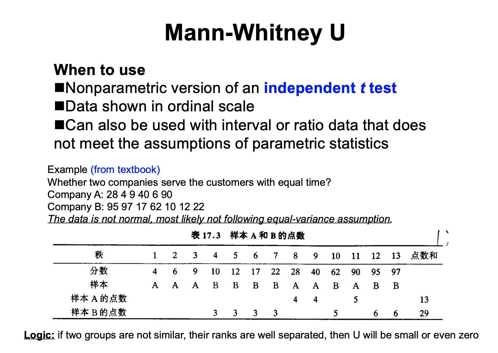{width="440"}

*作用:独立样本T检验的非参数替代方法,*

*适合有序分类数据,连续但不正态,不方差齐性的数据*

看两组谁分高谁分低

*H0:两组样本来自同一分布,即两组的分布位置相同(中位数相等)*

```{r}
# Check if the package was already installed
if (!requireNamespace("haven", quietly = TRUE)) {
  install.packages('haven')
}
# Load the package used to read .sav data
library(haven)

# Load the data
two_samples_data <- read_sav("../data/sav_files/Data12-06.sav")

# data processing
temp = two_samples_data$ycss;#因变量
group = two_samples_data$zb;#分组变量
group1 = temp[group==1];#分组1下的所有因变量
group2 = temp[group==2];#分组2同理

# Conduct Mann-Whitney U test
# The codes are similar to Wilcoxon T test
# except that the 'paired' is set to False
wilcox.test(x = group1, y = group2, alternative = "two.sided", 
            paired = F)

# Why do you see a 'warning'?
# Let's see a slightly different dataset
# which doesn't contain ties（tie指的是数据集合中的重复值）
temp_new = c(5.5, 4.6, 4.4, 3.7, 3.401, 3.399, 2.0, 1.9,
             1.6, 1.1, 0.802, 0.801, 0.8, 0.799, 0.798,
             0, -0.1, -0.2, -1.2, -1.6)

group = two_samples_data$zb;
group1 = temp_new[group==1];
group2 = temp_new[group==2];

wilcox.test(x = group1, y = group2, alternative = "two.sided", 
            paired = F)#独立的两拨人,所以勾选不配对
```

##### 2. K-S test

*作用:检验两组样本是否来自完全相同的分布(是不是复制粘贴)*

\*对重复值超级敏感\*\*只适合连续性数据\* 数据处理的部分和MU一样

```{r}
# Check if the package was already installed
if (!requireNamespace("haven", quietly = TRUE)) {
  install.packages('haven')
}
# Load the package used to read .sav data
library(haven)

# Load the data
two_samples_data <- read_sav("../data/sav_files/Data12-06.sav")

# data processing
temp = two_samples_data$ycss;
group = two_samples_data$zb;
group1 = temp[group==1];
group2 = temp[group==2];

# Conduct K-S test
ks.test(group1, group2, alternative = "two.sided")
#ks.test(数据集1，数据2，alternative=)
```

##### 3.Moses Extreme Reaction test

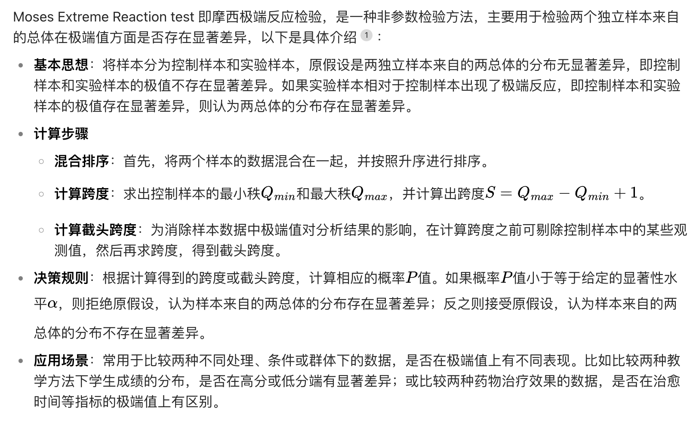{width="440"}

*作用:主要用于检验两个独立样本来自的总体在极端值方面是否存在显著差异.*

*H0:两独立样本来自的总体分布无显著差异,即两组的极端值无明显区别*

数据处理部分和MWU一模一样 空值(Null)或整数表示要从两个极端剔除的百分比.

```{r}
# Check if the package was already installed
if (!requireNamespace("DescTools", quietly = TRUE)) {
  install.packages('DescTools')
}
if (!requireNamespace("haven", quietly = TRUE)) {
  install.packages('haven')
}
# Load the packages
library(haven)
library(DescTools)

# Load the data
two_samples_data <- read_sav("../data/sav_files/Data12-06.sav")

# data processing
temp = two_samples_data$ycss;
group = two_samples_data$zb;
group1 = temp[group==1];
group2 = temp[group==2];

# Conduct the test
# Null or an integer number indicates the percentage to be dropped from the two extremes
MosesTest(group1, group2, NULL)  
#MosesTest(数据1，数据2，NULL)
```

##### 4.Wald-Wolfowitz Runs test

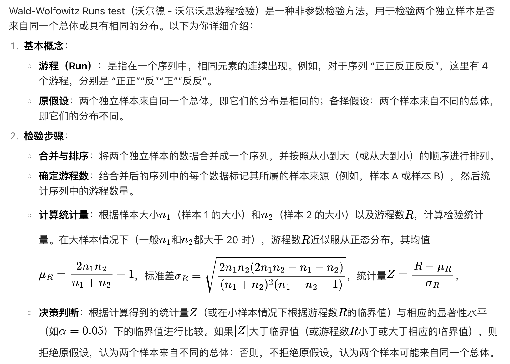{width="440"}

```{r}
# Check if the package was already installed
if (!requireNamespace("DescTools", quietly = TRUE)) {
  install.packages('DescTools')
}
if (!requireNamespace("haven", quietly = TRUE)) {
  install.packages('haven')
}
# Load the packages
library(haven)
library(DescTools)

# Load the data
two_samples_data <- read_sav("../data/sav_files/Data12-06.sav")

# data processing
temp = two_samples_data$ycss;
group = two_samples_data$zb;
group1 = temp[group==1];
group2 = temp[group==2];

# Conduct the test
# if there is no y, then it would be testing the randomness of a binary distribution (in Lecture one)
RunsTest(x = group1, y = group2, alternative="two.sided",exact=TRUE) 

# Why do you see a 'warning'?
# Let's see a slightly different dataset
# which doesn't contain ties
temp_new = c(5.5, 4.6, 4.4, 3.7, 3.401, 3.399, 2.0, 1.9,
             1.6, 1.1, 0.802, 0.801, 0.8, 0.799, 0.798,
             0, -0.1, -0.2, -1.2, -1.6)

group = two_samples_data$zb;
group1 = temp_new[group==1];
group2 = temp_new[group==2];

RunsTest(x = group1, y = group2,alternative="two.sided", exact=TRUE) 
```

### *③Non-parametric Test III K个样本非参数检验*

非参数检验III K个样本(相关\\独立)的非参数检验和非参数相关分析,是参数检验(ANOVA,皮尔逊相关)的替代方案,适用于不满足正态性,存在异常值,数据为等级\\二分类的场景.

#### (1)K个相关样本检验

适用于同一对象接受K次处理,同一评分员评K个对象等重复测量\\随机区组设计,

替代单因素重复测量ANOVA,核心检验K个相关组的分布位置\\一致性差异\

##### 1.Friedman test & Kendall's W

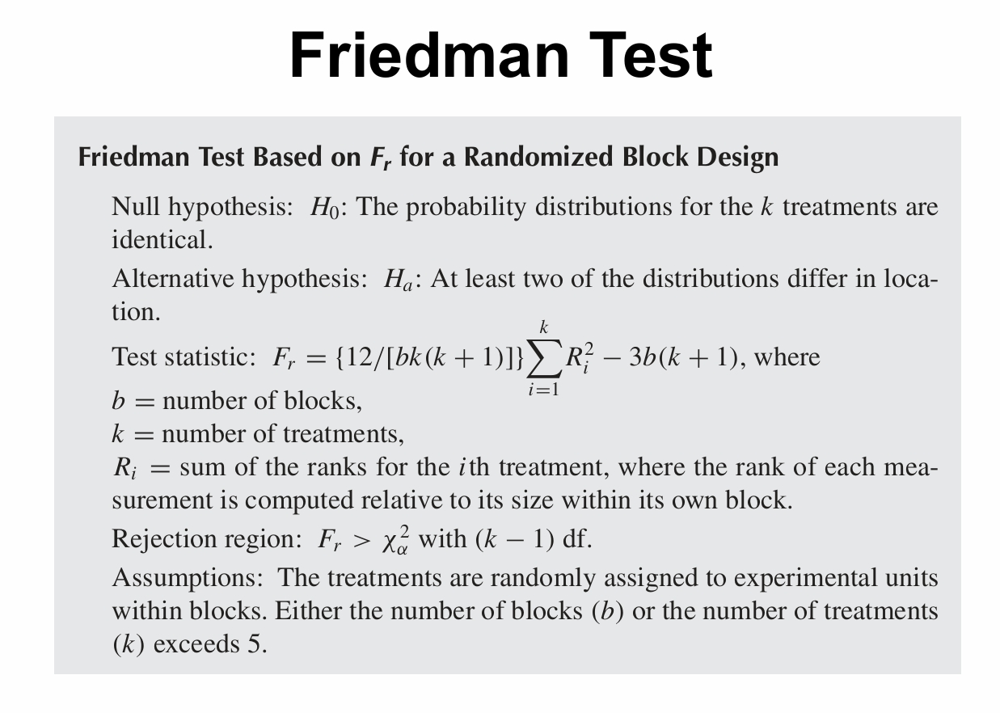{width="440"}

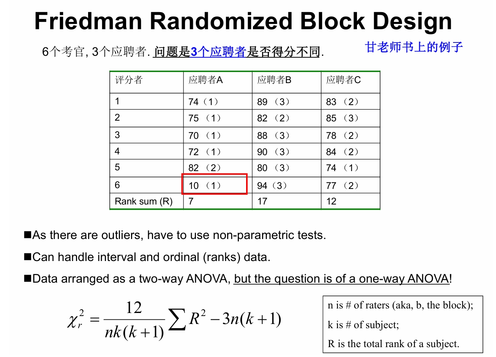{width="440"}

*作用:随机区组设计的核心非参数检验,替代单因素重复测量ANOVA,检验K个相关样本的概率分布位置是否存在显著差异.*

适用范围:数据类型为计量(区间\\比率)或有序等级数据；

设计:

K个相关样本(随机区组),处理在区组内随机分配；

前提:存在异常值\\不满足正态性(参数ANOVA前提), 块数b或处理数k至少一个\>5(大样本卡方近似

*H0:K个处理(treatment)的概率分布完全相同(但是你不知道实际怎么分布)；*

(n或者b=区组数\\块数,k=受试者数量,也写作$\chi_r^2$)

判定:(卡方临界值,df=k-1)→拒绝H0；

小样本查专用临界值表.卡方通常找右边的尾巴,所以通常是大于临界值是拒绝H0

缺陷:仅检验分布位置,无法检验分布形状\\离散度；小样本需查专用临界值表;结值过多时拉完了

```{r}
# Friedman test n个配对样本检验 和Kw本质上是一个东西，但这个更多是看被评价者之间有无区别，KW是看评委的给分一致性
# example: people rating 3 types of shirts(ranking)

# Check if the package was already installed
if (!requireNamespace("haven", quietly = TRUE)) {
  install.packages('haven')
}
if (!requireNamespace("irr", quietly =TRUE)) {
  install.packages('irr')
}

# Load the package used to read .sav data
library(haven)
k_related_samples = read_sav("../data/sav_files/Data12-09.sav")
k_related_samples = as.matrix(k_related_samples)

# conduct the test
friedman.test(k_related_samples[,2:4])

library(irr)
irr::kendall(t(k_related_samples[,2:4]))  
```

##### 2.Cochran's Q

作用：McNemar检验的K样本延伸,检验K个相关样本的二分类数据分布是否存在差异,核心分析多个相关二分类组的概率差异

适用范围：数据类型:*只能是*严格二分类数据(0\\1,如通过\\失败,及格\\不及格)；

自变量连续,因变量二分类 同一对象接受K个处理的二分类结果,K个相关样本.

*H0:K个处理的二分类结果概率分布完全相同；*

```{r}
# Cochran's Q test  自变量连续 因变量二分类
# dichotomous data; eg: success\failing

# Check if the package was already installed
if (!requireNamespace("rstatix", quietly = TRUE)) {
  install.packages('rstatix')
}

# Load the package used to conduct the test
library(rstatix)

# create the data
mydata = data.frame(
  outcome = c(0,1,1,0,1,1,1,1,1,1,0,1,0,0,0,1,1,1,1,0,1,1,1,1,0,0,1,0,0,1),
  treatment = gl(3,1,30,labels=LETTERS[1:3]),
  participant = gl(10,3,labels=letters[1:10])#3个元素，一个元素重复1次，总共有30个
)
#gl(水平数,每个水平重复数,总数据量,labels=分组名)

head(mydata)
# conduct the test
cochran_qtest(mydata, outcome ~ treatment|participant)
#cochran_qtest(数据框,二分类结果~处理组|ID)
#缺陷:仅能处理二分类数据
#小样本时卡方近似效果差,拉完了.无统一的结值处理标准,结果易受影响.

```

y是检验的因变量名称\
outcome，即二分类结局变量（0\\1编码，如是否有效、是否出现症状）

n 总样本量（被试 \\ 参与者数量）

statisticCochran'sQ检验统计量5.333，

Q统计量近似服从自由度为df=k−1的卡方分布（k为处理条件数）

df 自由度

p 检验的 p 值

结论：

为检验 3 个处理条件下二分类结局的差异，采用 Cochran's Q 检验进行分析，原假设为各处理条件的结局发生率无差异。

结果显示，Cochran's Q (2, N=10)=5.33，p=0.070\>0.05， 不拒绝原假设，表明 3 个处理条件下的二分类结局发生率不存在显著差异

#### (2)k个独立分组检验

(如不同职业,不同工艺组),替代单因素独立样本ANOVA,核心检验K个独立组的分布位置\\中位数\\趋势差异

##### 1.Kruskal-Wallis test

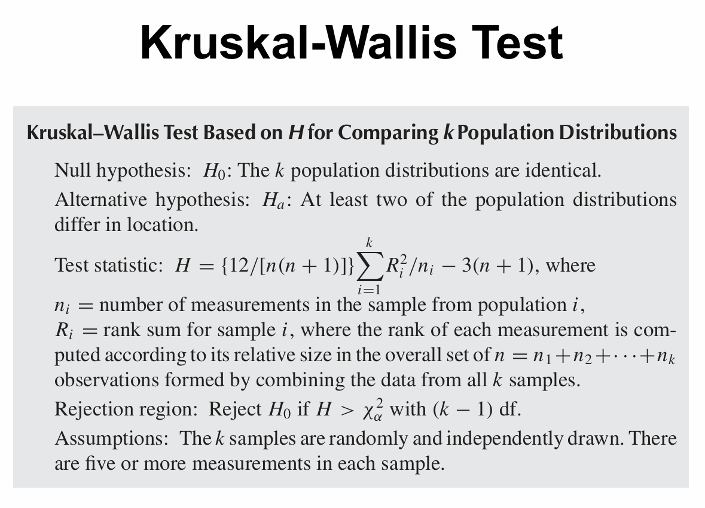{width="440"}

*作用：非参数版单因素独立样本ANOVA,是Mann-WhitneyU检验的K样本延伸,检验K个独立样本的概率分布位置是否存在显著差异.*

适用范围 数据类型:计量(区间\\比率)或有序等级数据；

设计:K个独立随机样本,每个样本量≥5(大样本卡方近似)；

前提:不满足正态性\\方差齐性(参数ANOVA前提).

*H0:K个总体的概率分布完全相同；*

类似MWU,如果组别数应该相似差别不大,秩次应该混合

判定:H服从卡方分布(df=k-1),

```{r}
# Kruskal-Wallis test

# Check if the package was already installed
if (!requireNamespace("haven", quietly = TRUE)) {
  install.packages('haven')
}

# Load the package used to read .sav data
library(haven)
k_indpt_samples = read_sav("../data/sav_files/Data12-07.sav")
k_indpt_samples$ff = as.factor(k_indpt_samples$ff)

# conduct the test
kruskal.test(ydp1~ff,data = k_indpt_samples)
#k_indpt_samples$分组变量=as.factor(k_indpt_samples$分组变量)
#kruskal.test(因变量~分组变量,data=k_indpt_samples)

```

##### 2.Median test

```{r}
# Median test 其实没有什么用，不再详细展开

# Check if the package was already installed
if (!requireNamespace("haven", quietly = TRUE)) {
  install.packages('haven')
}
if (!requireNamespace("agricolae", quietly = TRUE)) {
  install.packages('agricolae')
}


# Load the package used to read .sav data
library(haven)
k_indpt_samples = read_sav("../data/sav_files/Data12-07.sav")
k_indpt_samples$ff = as.factor(k_indpt_samples$ff)

# Load the package used to conduct the test
library(agricolae)

# conduct the test
Median.test(k_indpt_samples$ydp1,k_indpt_samples$ff)

```

##### 3.Jonckheere-Terpstra test

*作用：Mann-WhitneyU检验的K样本延伸,专门检验有序分组的K个独立样本的分布位置是否存在单调趋势(如随剂量升高,中位数递增),比K-W检验更适用于有序分组.*

适用范围 数据类型:计量\\等级数据；

它是有一个先验单调假设的,如果这个假设是错的,JT检验就不好使

设计:K个独立样本,分组变量为有序分类(如年龄组:青年\\中年\\老年；剂量组:低\\中\\高)；

优势:检测趋势性差异的效能远高于K-W检验.

*H0:K个有序总体的分布位置无单调趋势；*

Ha:K个有序总体的分布位置存在单调趋势(递增\\递减)

```{r}
# Jonckheere-Terpstra test 假设组别是存在顺序的 有一个明确的假设的时候用，但如果只是看有无差异就用KW
# the group factor must be ordered or numric 

# Check if the package was already installed
if (!requireNamespace("haven", quietly = TRUE)) {
  install.packages('haven')
}
if (!requireNamespace("DescTools", quietly = TRUE)) {
  install.packages('DescTools')
}

# Load the package used to read .sav data
library(haven)
k_indpt_samples <- read_sav("../data/sav_files/Data12-07.sav")
k_indpt_samples$ff <- as.ordered(k_indpt_samples$ff)

# Load the package used to conduct the test
library(DescTools)

# conduct the test
JonckheereTerpstraTest(k_indpt_samples$ydp1,k_indpt_samples$ff)
JonckheereTerpstraTest(k_indpt_samples$ydp1,k_indpt_samples$ff, nperm=5000)
#k_indpt_samples$分类变量<-as.ordered(k_indpt_samples$分类变量)一定要注意这个as.ordered()非常坑人
#JonckheereTerpstraTest(x=因变量,g=分类变量,alternative=,nperm=)
#x是因变量,是numeric,一个被试一个值
#g是分组变量,必须是有序因子
#nperm是用后面的随机置换分组次数算经验p值,小样本用

```

{width="536"}

{width="536"}

\

## 二.Nonparametric correlation tests非参数相关性

### 1. Kendall's tau

(1)Kendall’stau 作用:衡量两个有序变量之间的秩相关强度和方向

*适用于:变量是排名\\等级(ranking)更适合小样本*

*H0:两个有序变量没有秩相关(顺序完全随机\\A情况排名和B情况排名没有关联)*

```{r}
# example: Whether the revenue(ranking) in 2014 is correlated with that in 2015 
# Check if the package was already installed 
if (!requireNamespace("haven", quietly = TRUE)) {   
  install.packages('haven') 
}  
# Load the package used to read .sav data
library(haven)  
data2 <- read_sav("../data/sav_files/companies.sav")  
# conduct the test 
cor.test(data2$rev14, #第一个有序变量（14年的营收排名）   
         data2$rev15, #第二个有序变量（15年的）   
         alternative = "two.sided",    method = "kendall") 
#cor.test(第一个有序变量,第二个有序变量,alternative=,method=) #two.sided检测是不是相关,less是负相关,greater是正相关 
```

### 2.Kendall's W

*作用:衡量评分者对同一组对象评分的一致性程度\
H0:评分者之间完全不一致(排名随机,无共识)*\
只处理秩次\\排名数据 W接近1→一致性很强；\
接近0→一致性很弱 χ2\>χdf,α2(或p\<α)→拒绝H0,认为评分者间存在显著一致性.\
（其实很多涉及\$\chi\$值的都是算出来的\$\\chi\$大于临界就拒绝零假设

```{r}
# Check if the package was already installed 
if (!requireNamespace("haven", quietly = TRUE)) {   
  install.packages('haven') 
  } 
if (!requireNamespace("irr", quietly = TRUE)) {   
  install.packages('irr') 
  }  
# Load the package used to read .sav data
library(haven) 
data3 <- read_sav("../data/sav_files/beertest.sav")  # Load the package used to conduct the test 
library(irr) 
# 1. 加载irr包
library(irr)
head(data3)
# 2. 准备数据：去掉评委姓名列，只保留评分数据

irr::kendall(t(data3[1:5,2:7])) # 强制加载，否则环境多了有个重名的函数
#1:5,指的是横着看第一到第五行是不同的评委给的数据，2:7指的是竖着看是每个选手接受的不同的评价
```

### 3.Spearman Correlation

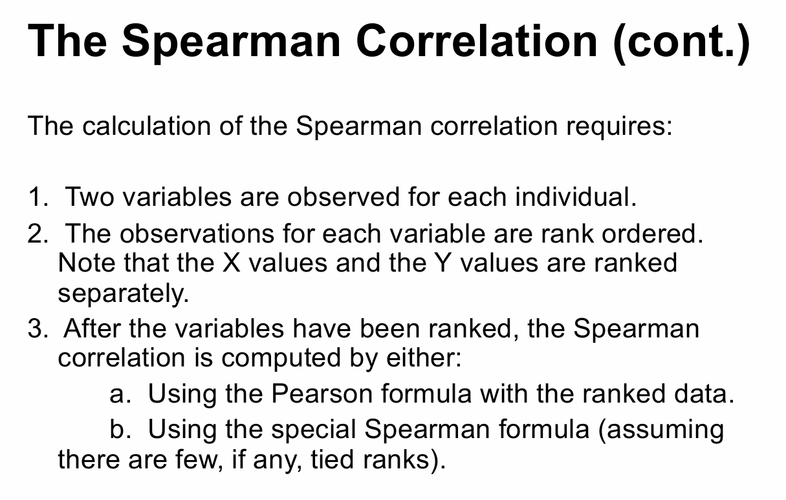{width="440"}

作用替代皮尔逊相关,衡量两个变量间的单调相关程度(非严格线性),是最常用的非参数相关指标.

适用范围

数据类型:有序等级数据,或计量数据但不满足正态性；

变量关系:变量间存在单调关系(递增\\递减,非严格线性)；

*H0:两个变量间无单调相关(ρ=0)；*

*H1:两个变量间存在显著单调相关(ρ≠0\\ρ\>0\\ρ\<0,单侧\\双侧)*

```{r}
# Spearman test 
# variables are ordinal  
# Check if the package was already installed 
if (!requireNamespace("bruceR", quietly = TRUE)) {   
  install.packages('bruceR') 
  } 
if (!requireNamespace("readxl",quietly = TRUE)) {   
  install.packages('readxl') 
  }   
# Load the package used to read .xlsx data 
library(readxl) 
data_spearman = read_xlsx("../data/excel-files/IQ_performance.xlsx") 
x = data_spearman$IQ 
y = data_spearman$Performance  
# Load the package used to conduct the test 
library(bruceR)  
# conduct the test 
Corr(data_spearman[,1:2], method = "spearman") 
cor.test(x,y,method = "spearman")  
cor.test(x,y,method = "pearson")  
#data=read_excel(“iq_test.xlsx”) 
#x=data$x,y=data$y 
#cor.test(x,y,method="spearman") 
#pearson:适合正态分布＋线性,重点是线性 
#spearman适合非正态\等级\非线性,重点是单调相关程 
```

### 4.Point biserial correlation

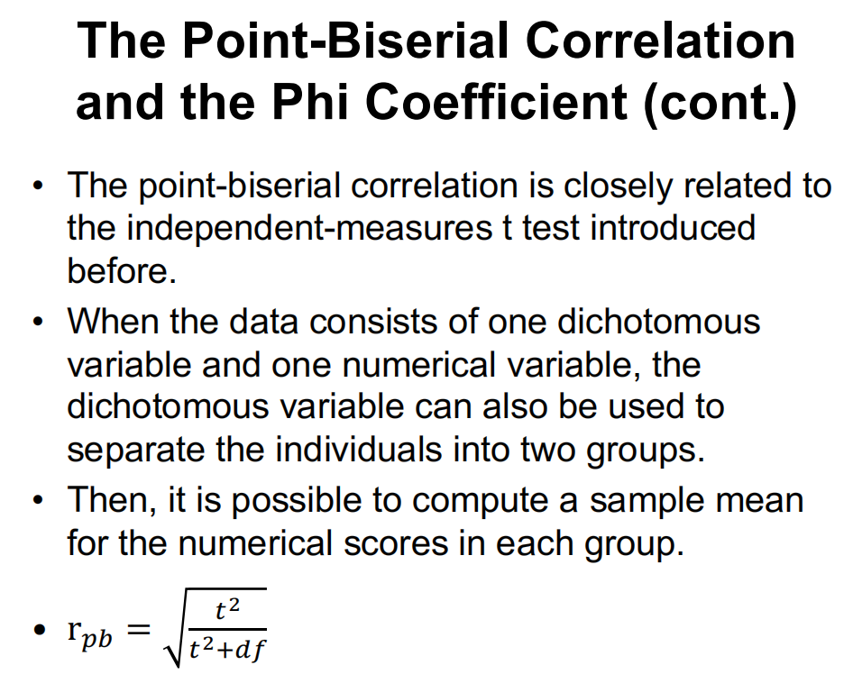{width="358"}

作用:衡量一个真正二分类变量与一个计量\\等距变量间的相关程度,是皮尔逊相关的特殊形式,也可作为独立样本t检验的效应量指标.

适用范围:变量类型:一个为真正二分类变量(如性别,是否患病,非人为二分),另一个为计量\\等距变量；.

\$H_0\$:二分类变量与计量变量间无相关(\$r\_{pb}=0\$)；

H1:两者间存在显著相关(r\_{pb}\neq0).

cor.test(二分类变量,连续变量)

#连续变量需要满足正态性

```{r}
# point-biserial correlation 
# x:dichotomous; y:numerical  
# Check if the package was already installed 
if (!requireNamespace("readxl", quietly = TRUE)) {   
  install.packages('readxl') 
  }  
# Load the package used to read .xlsx data 
library(readxl) 
data_pb = read_excel("../data/excel-files/PointBiserial_correlation.xlsx") 
x = data_pb$condotion 
y = data_pb$grade  
# conduct the test 
cor.test(x,y)
```

### 5.Phi Coefficient

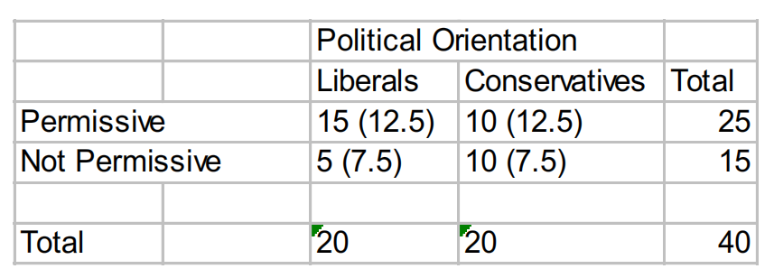{width="344"}

```{r}
# Phi Coefficient 一列是二分类，另一列是连续 
# x & y: both dichotomous  
# Check if the package was already installed 
if (!requireNamespace("psych", quietly = TRUE)){   
  install.packages('psych') 
  }  
# create the data 
phi_dataset = matrix(c(15,10,5,10),nrow=2,ncol=2)  
# Load the package used to conduct the test 
library(psych)  
# conduct the data 
phi_correlation = phi(phi_dataset) 
phi_correlation  
permissive <- c(rep(1, 15), rep(0, 5), rep(1, 10), rep(0, 10)) 
liberal <- c(rep(1, 20), rep(0, 20)) 
cor.test(permissive, liberal)
```

# PART 2 各类方差分析

## 1.ANCOVA有协变量方差分析

### (1). ANCOVA Assumptions前提假设检验

Slides p5-8

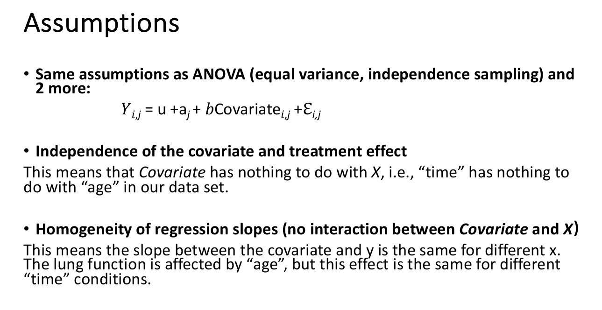{width="440"}

作用:以ANOVA为基础,先剔除连续型协变量对因变量的效应,实现两个核心目标:

减少组内“无法解释的误差方差”,提升检验的统计效力；

消除协变量带来的混杂偏倚,更精准地分析分类自变量对连续因变量的真实效应.

适用范围:原本为单因素\\多因素ANOVA问题(因变量连续,自变量为分类变量)；

存在连续型协变量:该变量非实验核心操纵变量,但对因变量有显著影响

(举例子：age是协变量,time是二分类自变量,vitalcp是因变量)；

适用于实验研究\\观察性研究(观察性研究可放宽部分假设)；

数据满足ANOVA基本假设+ANCOVA特有假设.

*H₀:控制协变量后,自变量不同水平下因变量的总体均值相等*

(比如说:控制年龄后,不同工作时间组的肺容量总体均值无差异)；

协变量假设:协变量对因变量无显著线性效应(即协变量的回归斜率b=0).

算法\\计算逻辑:ANCOVA本质是带分类自变量的线性回归模型 $$Y_i=b_0+b_1X_1i+b_2⋅Covariate_i$$

```{r}
# ANCOVA assumptions
## equal variance
## independence of the covariate and treatment effect
## Homogeneity of regression slopes

# Check if the package was already installed
if (!requireNamespace("haven",quietly = TRUE)) {
  install.packages('haven')
}

if (!requireNamespace("car",quietly = TRUE)) {
  install.packages('car')
}

# Load the package used to read .sav data
library(haven)
df = read_sav("../data/sav_files/data09-06.sav")
y = df$vitalcp
x = as.factor(df$time)
covariate = df$age

# Load the package used to test the assumption of equal variance 
library(car)
leveneTest(y ~ x)
# ==============================================
# 假设1：方差齐性检验（Levene's Test）
# 原理：检验不同分组下因变量的方差是否相等
# ==============================================
# 语法：leveneTest(因变量 ~ 分组变量, center = median)
# center=median：以中位数为中心计算，比均值更稳健，抗 outliers
leveneTest(y ~ x, center = median) 

# ==============================================
# 假设2：残差正态性检验（Shapiro-Wilk Test）
# 原理：检验模型残差是否服从正态分布（ANCOVA的基础前提）
# ==============================================
# 先拟合含交互项的回归模型（斜率齐性检验的模型，用其残差做正态性检验）
model_interaction <- lm(y ~ covariate * x)
# 提取残差，做Shapiro-Wilk正态性检验
shapiro.test(residuals(model_interaction))

# ==============================================
# 假设3：协变量与处理效应独立性检验
# 原理：检验分组（处理）是否会影响协变量，若分组对协变量无显著影响，则满足独立性
# 方法：单因素ANOVA（协变量 ~ 分组变量）
# ==============================================
result_independence <- aov(covariate ~ x)
summary(result_independence)

# ==============================================
# 假设4：回归斜率齐性检验（核心假设）
# 原理：检验协变量与分组的交互项是否显著，不显著则满足斜率齐性
# 方法：含交互项的线性回归\ANOVA（因变量 ~ 分组 * 协变量，* 表示主效应+交互效应）
# ==============================================
# 重新定义变量（避免变量覆盖，保证代码可独立运行）
y <- df$vitalcp
x <- as.factor(df$time)
covariate <- df$age
result_slope <- aov(y ~ x * covariate)
summary(result_slope)
```

### (2). ANCOVA协方差分析

ANCOVA核心模型

```{r}
# ANCOVA

# conduct the test

## Method 1第一种办法 aov(因变量~自变量+协变量) summary(模型)
result = aov(y ~ x + covariate)
cat("\n")
summary(result)
cat("\n")
# 两种平方和是一样的
Anova(result, type="III")
cat("\n")
Anova(result, type="II")
```

```{r}
## Method 2第二种办法
if (!requireNamespace("HH", quietly = TRUE)) {
  install.packages('HH')
}
library('HH')
df$time<-as.factor(df$time)
ancova(vitalcp ~ age + time,data = df)#ancova(因变量~自变量+协变量，data=数据来源)
```

```{r}
# conduct the effect size效应量检验
if (!requireNamespace("rstatix", quietly = TRUE)) {
  install.packages('rstatix')
}
library('rstatix')
partial_eta_squared(result)
```

### (3)Post-hoc test

```{r}
# post-hoc test

## Method 1你用了第一种办法就这样时候检验
if (!requireNamespace("multcomp", quietly = TRUE)) {
  install.packages('multcomp')
}
library('multcomp')#glht(模型,linfct=mcp(x="Tukey"))
postHocs <- glht(result, linfct = mcp(x = "Tukey"))
summary(postHocs)
```

```{r}
## Method 2
if (!requireNamespace("emmeans", quietly = TRUE)) {
  install.packages('emmeans')
}
library('emmeans')
emmeans(result, pairwise ~ x, adjust = 'tukey')
#emmeans(模型,pariwise~x,adjust="tukey")
```

### (4)Ancova & Linear model

```{r}
# the relations between linear model and ANCOVA
lresult = lm(y ~ x + covariate)
summary(lresult)

# transform the result
anova(lresult)

# model comparison模型比较：检验回归斜率齐性
# Model 1：主效应模型（无交互项）→ 满足斜率齐性假设
m1 = aov(vitalcp ~ factor(age) + time, data = df)
# Model 2：交互效应模型（含交互项）→ 检验斜率是否不齐
m2 = aov(vitalcp ~ factor(age) * time, data = df)
anova(m1, m2)


```

## 2.Latin Square拉丁方

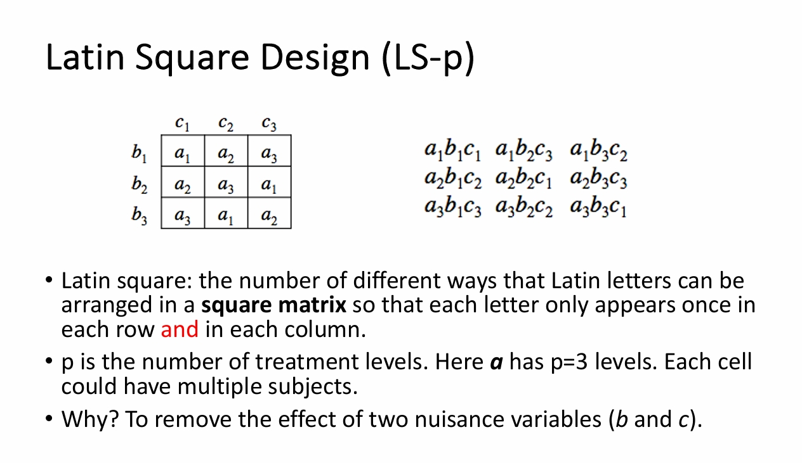{width="440"}

作用:针对单因素实验,**同时剔除两个相互独立的系统干扰变量(行因素,列因素)**的效应,进一步减少误差方差,提升检验力； 消除双维度系统误差的混杂(如田间试验的“行\\列位置”,实验的“时间\\空间”),更精准分析**处理因素(核心自变量)**的效应；

让实验设计更高效,避免无关变量对因变量的干扰.

适用范围 仅适用于单因素实验(一个核心处理因素,有p个水平)；

存在两个相互独立的干扰变量(行因素,列因素)

行因素,列因素,核心处理之间没有关系

设计硬性要求:处理因素的水平数p=行因素水平数=列因素水平数； 拉丁方的排列规则:每个处理在每行,每列仅出现一次(无重复)；

处理因素H₀:不同处理水平下因变量的总体均值相等(H0:μ.1..=μ.2..=…=μ.p..,文档中:不同甜菜品种的产量均值无差异)；

行因素H₀:不同行的因变量总体均值相等(H0:μ..1.=μ..2.=…=μ..p.,文档中:田间不同行的产量均值无差异)；

列因素H₀:不同列的因变量总体均值相等(H0:μ...1=μ...2=…=μ...p.,文档中:田间不同列的产量均值无差异). 算法\\计算逻辑 拉丁方的核心是设计+方差分析,模型公式: $$Y_{ijkl}=μ+αj+βk+γl+ϵijkl$$ μ:总均值； $\alpha_j$:处理因素的效应；\
$\beta_k$:行因素的效应；\
$\gamma_l$:列因素的效应；\
$\epsilon_{ijkl}$:随机误差；\
i:样本量；\
j\\k\\l:处理\\行\\列的水平数,且j=k=l=p.\

```{r}
# Latin Square 节省被试量 假设abc不存在交互作用

# Check if the package was already installed
if (!requireNamespace("readxl", quietly = TRUE)) {
  install.packages('readxl')
}

# Load the package used to read .xlsx data
library(readxl)
yie = read_xlsx("../data/excel-files/veget.xlsx")
#
# conduct the test
fit = aov(yield~as.factor(rep)+as.factor(col)+as.factor(variety)
           ,data = yie)
summary(fit)
#构建ANOVA模型:因变量~行因素+列因素+处理因素
#fit=aov(yield~as.factor(rep)+as.factor(col)+as.factor(variety),data=yie)
#效应检验
Anova(fit, type = 'III')  #注意这个函数主要是画图标出来的


# conduct the post-hoc test事后检验
## Method 1
TukeyHSD(fit)

## Method 2
emmeans(fit, pairwise ~ variety, adjust = 'tukey')

```

## 3.Nested ANOVA有嵌套因子的方差分析

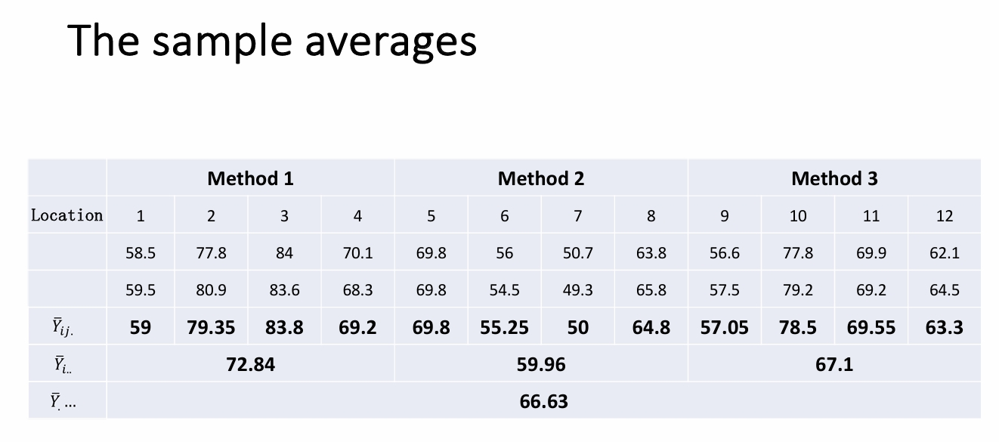{width="440"}

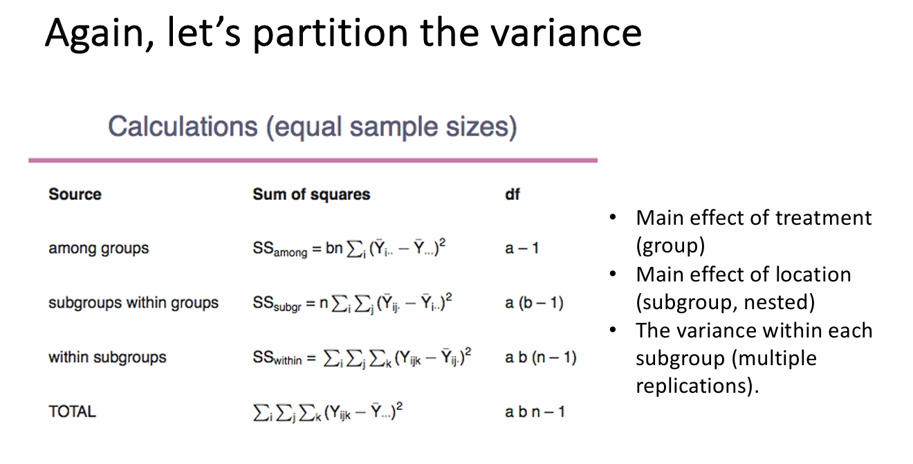{width="440"}

作用“：检验主因子的处理效应,同时控制嵌套在主因子内的次级因子的变异；

解决次级因子样本非独立,样本量有限的问题,避免直接用单因素ANOVA导致的假阳性.

适合范围：存在层级\\嵌套结构的实验设计,即次级因子(如location\\rat\\site)嵌套在主因子(如method\\technician\\habitat)中；

嵌套因子水平随主因子水平变化,无交叉；

可处理平衡\\非平衡数据(平衡数据易计算,非平衡需混合模型).

H₀(俩) 主因子效应:$\alpha_i=0$,即主因子各水平下因变量总体均值无显著差异；

嵌套因子效应:$\beta_{j\left(i\right)}=0$,即嵌套因子各水平在对应主因子内无显著差异.

方差来源：

组间(主要因子)df=a-1代表核心因子

组内子组(嵌套因子)df=a(b-1)主要是为防止假阳性

子组内(误差)df=ab(n-1)

总df=abn-1 SS\\df=MS,

```{r}
# nested ANOVA

# Check if the package was already installed
if (!requireNamespace("readxl",quietly = TRUE)) {
  install.packages('readxl')
}

if (!requireNamespace("lme4", quietly = TRUE)) {
  install.packages('lme4')
}

if (!requireNamespace("lmerTest",quietly = TRUE)) {
  install.packages('lmerTest')
}

# load the data,一定要注意as.factor()
library(readxl)
nestedData = read_excel("../data/excel-files/nested_anova.xlsx")
nestedData$method <- as.factor(nestedData$method)
nestedData$location <- as.factor(nestedData$location)

# Conduct the correct test  

## Method 1
#固定效应，用不着推广的那种
cat("========================================\n")
cat("Method 1: 固定效应嵌套 ANOVA (不推广到总体)\n")
cat("模型：DV ~ method + Error(location)\n")
cat("========================================\n")
aov.result = aov(DV ~ method + Error(location),data = nestedData)
summary(aov.result)
#其实还有别的写法，但是其他的需要手动矫正，为了方便我就不放别的玩意了
```

```{r}
## Method 2
#如果地点是随机抽取的，要推广到总体
#混合效应模型：(1|method\location)表示location嵌套在method里的随机效应
cat("========================================\n")
cat("Method 2: 混合效应嵌套 ANOVA (可推广到总体)\n")
cat("模型：lmer(DV ~ method + (1 | method/location))\n")
cat("========================================\n")
library(lme4)
library(lmerTest)
model_lmer <-lmer(DV ~ method + (1 | method/location), data = nestedData)
summary(model_lmer)
anova(model_lmer)

```

## 4.MANOVA多因素方差分析

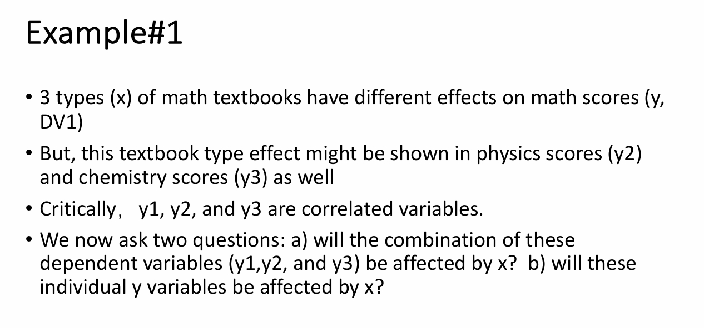{width="440"}

### 1.Assumptions(前提假设检验)

Slides p28-29

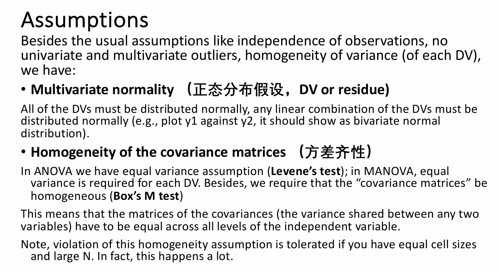{width="440"}

1.  观测独立；
2.  无单\\多元异常值；
3.  各DV方差齐性(Levene检验)\
    leveneTest(因变量，分组自变量) 经Levene方差齐性检验，各因变量在不同组别间方差齐性(p\>0.05)
4.  多元正态性(DV及任意线性组合正态,Shapiro-Wilk\\马氏距离检验)
5.  协方差矩阵齐性(Box'sM检验)或者说协方差同质；
6.  DV间不要求线性相关；但因变量无多重共线性(DV间r\<0.9,否则结果不稳定).

```{r}
# Check if the package was already installed
if (!requireNamespace("readxl", quietly = TRUE)) {
  install.packages('readxl')
}
if (!requireNamespace("effectsize", quietly = TRUE)) {
  install.packages('effectsize')
}
if (!requireNamespace("dplyr", quietly = TRUE)) {
  install.packages('dplyr')
}
if (!requireNamespace("mvnormtest", quietly = TRUE)) {
  install.packages('mvnormtest')
}
if (!requireNamespace("rstatix", quietly = TRUE)) {
  install.packages('rstatix')
}
if (!requireNamespace("car", quietly = TRUE)) {
  install.packages('car')
}
if (!requireNamespace("heplots", quietly = TRUE)) {
  install.packages('heplots')
}
```

```{r}
# MANOVA Assumptions
## Multivariate normality
## Equal variance
## Homogeneity of the covariance matrices
## Linearity

# load the data
library(readxl)
salaryData = read_xlsx("../data/excel-files/example.xlsx")
IV = cbind(salaryData$salary, salaryData$salbegin)
jobcat = as.factor(salaryData$jobcat)
gender = as.factor(salaryData$gender)

cat("==================================================\n")
cat("Assumption 1: Multivariate Normality (多元正态性)\n")
cat("==================================================\n")
library('mvnormtest')
library('dplyr')
library('rstatix')
mshapiro.test(t(IV))
salaryData %>%
  group_by(jobcat) %>%
  shapiro_test(salary, salbegin) %>%
  arrange(variable)#多元正态性在之前就有了我就不再多写

cat("\n==================================================\n")
cat("Assumption 2: Equal Variance (方差齐性)\n")
cat("==================================================\n")
library('car')
leveneTest(salaryData$salary,jobcat)
leveneTest(salaryData$salbegin,jobcat)


cat("\n==================================================\n")
cat("Assumption 3: Homogeneity of Covariance Matrices (协方差矩阵齐性)\n")
cat("==================================================\n")
library('heplots')
boxM(cbind(salary, salbegin) ~ factor(jobcat), data = salaryData)


cor.test(salaryData$salary, salaryData$salbegin)

```

### 2.MANOVA Test

```{r}
# conduct MANOVA
cat("=============MANOVA整体检验结果===============")
cat("\n")
fit = manova(IV ~ jobcat)
summary(fit)  
cat("\n")
cat("=============分因变量的单因素ANOVA===============")
cat("\n")
# The ANOVAs for the two DVs separately
summary.aov(fit)  

# effect size
library(effectsize)
effectsize::eta_squared(fit)

```

### 3.Post-hoc Test

```{r}
# post-hoc

# library packages to conduct the test
library('dplyr')
library('rstatix')

# 1. 数据重塑（长格式转换）：gather()是关键函数
# 语法：gather(数据框, 新列名_变量类型, 新列名_变量值, 需转换的因变量1, 因变量2,...)
# 这里：
# key = "variables"：新建一列，命名为variables，存储“因变量名称”（salary\salbegin）
# value = "value"：新建一列，命名为value，存储“因变量的具体数值”
# salary, salbegin：需要同时做检验的2个因变量（对应图中variables列的2个类别）
pwc <- salaryData %>%
  gather(key = "variables", value = "value", salary, salbegin) %>%
# 2. 按分组变量分组：按variables分组，对每个因变量单独做检验
  group_by(variables) %>%
# 3. 执行Games-Howell检验
# 语法：games_howell_test(因变量数值列 ~ 分组自变量列)
# value：因变量数值（由gather转换而来）
# jobcat：分组自变量（工作类别，多水平）
  games_howell_test(value ~ jobcat)
# 4. 输出结果：pwc存储所有两两比较的结果
pwc

```

\

# PART3 Logistic Regression逻辑回归

## 1.Logistic Regression逻辑回归

Slides p3-19

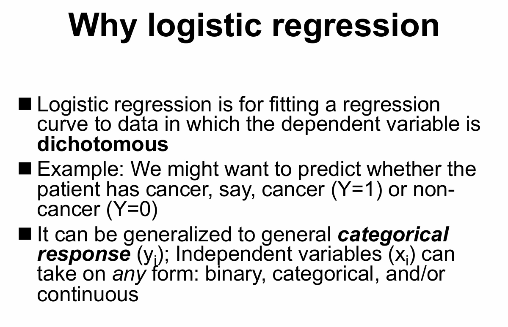{width="440"}

逻辑回归(BinaryLogisticRegression)\
作用：针对二分类因变量(如患病\\不患病,事件发生\\不发生)构建回归模型,\
核心目标是:①预测事件发生的概率；\
②分析自变量对二分类结局的影响效应,解决线性回归无法处理二分类因变量的缺陷.\
使用范围\
因变量为二分类变量(服从伯努利分布,取值0\\1)；\
自变量无类型限制,可同时纳入连续型,二分类,多分类变量；\
适用于结局预测,危险因素识别,二分类模式识别场景,替代不适用的线性回归.\

使用步骤\
数据清洗:剔除异常值,缺失值,完成样本筛选；\
分类自变量处理:对多分类自变量进行虚拟变量编码；\
模型构建:基于logit变换构建模型,核心公式为: $$Logit\left(\operatorname{p}_i\right)=ln\left(\frac{\operatorname{p}_i}{1-\operatorname{p}_i}\right)=\alpha+\beta_1\operatorname{x}_1+\ldots+\beta_k\operatorname{x}_k$$ 参数估计:通过最大似然估计求解模型的截距α和回归系数β；\
统计检验:对单个系数,模型整体进行显著性检验；\
拟合评估:检验模型拟合优度,对比不同模型的拟合效果；\
预测与解读:计算事件发生预测概率,通过OR值解读自变量的效应大小.\

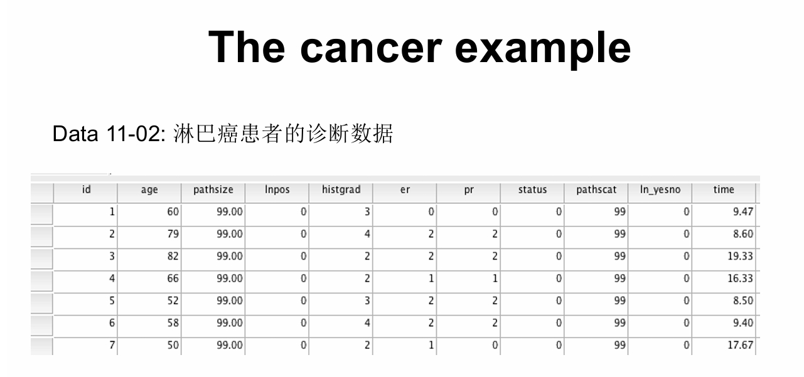{width="440"}

```{r}
# Logistic regression

# Check if the package was already installed
if (!requireNamespace("readxl", quietly = TRUE)) {
  install.packages('readxl')
}
if (!requireNamespace("aod", quietly = TRUE)) {
  install.packages('aod')
}

# ==================== 1. 加载包与数据预处理 ====================
# 加载readxl包(工具包)：用于读取Excel格式文件
library(readxl)

# read_xlsx("..\data\excel_files\文件路径)：读取指定Excel文件，返回数据框并赋值给logisticData
logisticData <- read_xlsx("../data/excel-files/Data11-02.xlsx")

# attach(数据框)：绑定数据框，可直接调用列名（无需数据框$列名）
attach(logisticData)

# ==================== 2. 缺失值\异常值处理 ====================
# 筛选规则：剔除pathscat=99的异常样本，对所有变量做子集筛选
# 向量[筛选条件]：保留满足条件的元素，生成新变量
ln_yesno1 = ln_yesno[pathscat != 99]    # 筛选后的二分类因变量
pathscat1 = pathscat[pathscat != 99]    # 筛选后的分类自变量
age1 = age[pathscat != 99]              # 筛选后的年龄变量
pathsize1 = pathsize[pathscat != 99]    # 筛选后的路径大小变量

# ==================== 3. 分类变量哑变量编码 ====================
# ifelse(判断条件, 满足返回值, 不满足返回值)：对分类变量做二分类哑变量转换
pathsCat1 = ifelse(pathscat1 == 1, 1, 0)  # pathscat=1时为1，其余为0
pathsCat2 = ifelse(pathscat1 == 2, 1, 0)  # pathscat=2时为1，其余为0

# ==================== 4. 拟合逻辑回归模型 ====================
# glm(公式, family=分布类型)：广义线性模型拟合函数
# 公式：因变量~自变量1+自变量2+...；family=binomial("logit")：指定逻辑回归模型
fit1 <- glm(ln_yesno1 ~  age1 + pathsize1 + pathsCat1 + pathsCat2, family = binomial("logit"))

# ==================== 5. 模型结果输出 ====================
cat("=========== 逻辑回归模型摘要结果 ==========\n")
# summary(模型对象)：输出模型详细结果（系数、标准误、p值、拟合优度等）
summary(fit1) 

# ==================== 6. 模型方差分析（卡方检验） ====================
cat("=========== 方差分析(卡方检验)结果 ==========\n")
# anova(模型对象, test=检验方法)：对模型做方差分析，test="Chisq"指定卡方检验
anova(fit1, test = "Chisq")

# ==================== 7. 效应量计算（优势比OR） ====================
cat("=========== 优势比(OR)及95%置信区间结果 ==========\n")
# exp()：对逻辑回归系数做指数转换，得到优势比(Odds Ratio)
# cbind(列名=向量, 函数)：合并系数与置信区间为矩阵
exp(cbind(OR = coef(fit1), confint(fit1)))

# ==================== 8. 回归系数的置信区间 ====================
cat("=========== 回归系数轮廓似然置信区间 ==========\n")
# confint(模型对象)：计算回归系数的轮廓似然95%置信区间（默认方法）
confint(fit1) 

cat("=========== 回归系数正态近似置信区间 ==========\n")
# confint.default(模型对象)：计算回归系数的正态近似95%置信区间
confint.default(fit1)

# ==================== 9. Wald检验（单独检验自变量显著性） ====================
# 加载aod包(工具包)：用于执行Wald检验
library('aod')

cat("=========== Age变量的Wald检验结果 ==========\n")
# wald.test(b=系数向量, Sigma=方差协方差矩阵, Terms=检验变量位置)：Wald检验函数
# Terms=2:2：检验模型中第2个系数（age1）的显著性
wald.test(b=coef(fit1),Sigma=vcov(fit1),Terms=2:2)

cat("=========== Pathsize变量的Wald检验结果 ==========\n")
# Terms=3:3：检验模型中第3个系数（pathsize1）的显著性
wald.test(b=coef(fit1),Sigma=vcov(fit1),Terms=3:3)
```

## 2.Model comparison模型比较

### The nested hypothesis test嵌套假设检验

\
假设模型0（$M_0$)嵌套在1（$M_1$)中

核心统计量定义 $$\Delta(y) = 2\ln L\left(\widehat{\theta}_1|y\right) - 2\ln L\left(\widehat{\theta}_0|y\right)$$

渐近分布 $$\Delta(y) \text{ 渐近服从 } \chi^2_{n-m} \text{ 分布}$$

决策规则 $$\text{若 } \Delta(y) > \chi^2_{n-m}(1-\alpha), \text{ 则拒绝 } M_0$$

```{r}
# The nested hypothesis test
# 嵌套假设检验：用于比较嵌套逻辑回归模型的拟合优度
cat("=========== 手动计算与零模型比较的检验结果 ==========\n")

# 手动计算：与零模型（仅截距）对比
# with(模型对象, 计算表达式)
with(fit1, null.deviance - deviance)  
# 计算零模型偏差与当前模型偏差的差值，反映模型拟合提升量
with(fit1, df.null - df.residual)  
# 计算零模型自由度与残差自由度的差值，即检验的自由度
with(fit1, pchisq(null.deviance - deviance, df.null - df.residual, lower.tail = FALSE))
# pchisq(卡方统计量, 自由度, lower.tail)：计算卡方检验的P值；lower.tail=FALSE表示计算上侧尾概率

cat("=========== 似然比检验(LR test)结果 ==========\n")
# 似然比检验
# glm(模型公式, family=分布)：拟合简化版逻辑回归模型（剔除pathsCat1、pathsCat2两个哑变量）
fit2 <- glm(ln_yesno1 ~  age1 + pathsize1, family = binomial("logit"))
# summary(模型对象)：输出简化逻辑回归模型的详细统计结果
summary(fit2)
# library(包名)：加载lmtest工具包，用于执行似然比检验
library(lmtest)
# lrtest(全模型, 简化模型)：对两个嵌套模型执行似然比检验，判断简化模型是否显著劣于全模型
lrtest(fit1, fit2)


cat("=========== 嵌套模型卡方检验比较结果 ==========\n")
# 特定模型两两比较
# anova(模型1, 模型2, test=检验方法)：对两个嵌套模型进行方差分析，指定卡方检验统计量
anova(fit1, fit2,test = "Chisq")
```

## 3.Test the model fitting检测模型的拟合程度

分类预测变量的**虚拟变量（哑变量）**（Dummy variables for categorical predictors）

伪决定系数（Pseudo r²，拟合优度指标）

### 1.Hosmer and Lemeshow test

是模型卡方检验的替代方法（通过总观测数进行标准化）。该检验会比较**观测频率（某一类别内的观测数量）与模型预测频率。若检验结果不显著**，说明模型拟合效果良好，与实际数据的差异无统计学意义。

```{r}
# Hosmer and Lemeshow test

# Check if the package was already installed
if (!requireNamespace("ResourceSelection",quietly = TRUE)) {
  install.packages('ResourceSelection')
}

# conduct the test
library(ResourceSelection)
# hoslem.test(x=观测值, y=拟合值, g=分组数)：执行Hosmer-Lemeshow检验
# x：实际观测的二分类因变量；y：模型预测的拟合概率值；g=10：将数据划分为10个组
hoslem.test(x = ln_yesno1, y = fitted(fit1), g = 10) 

```

### 2.Psuedo r\^2 伪R\^2

```{r}
# Psuedo r^2

# Check if the package was already installed
if (!requireNamespace("pscl", quietly = TRUE)) {
  install.packages('pscl')
}

# conduct the test
library(pscl)
## r2CU is the Nagelkerke R^2; r2ML is the Cox&Snell R^2
# pR2(模型对象)：计算逻辑回归的多种伪决定系数，参数为拟合完成的glm模型
pR2(fit1)

# log likelihood
# logLik(模型对象)：计算模型的对数似然值，用于评估模型拟合优度
logLik(fit1)
```

## 4.Prediction预测

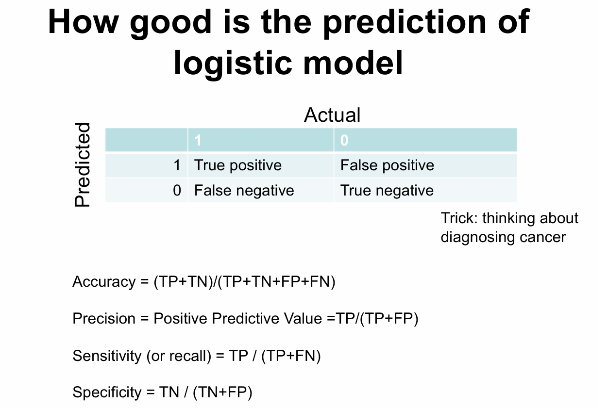{width="440"}

```{r}
# Making Classification Table

raw_x = data.frame(age1,pathsize1,pathsCat1, pathsCat2);
# predict(模型对象, newdata, type) 基于已拟合模型对新数据进行预测，
#type="response" 返回事件发生的概率值
pred_y = predict(fit1,raw_x,type="response") 
# data.frame(列名1 = 向量1, 列名2 = 向量2) 创建数据框，round(pred_y, 0) 将预测概率四舍五入为 0\1 分类结果
classification_df = data.frame(observed_y = ln_yesno1, predicted_y = round(pred_y,0))
# xtabs(公式, data) 根据公式生成列联表，~ observed_y + predicted_y 表示按观测值和预测值两个维度计数
xtabs(~observed_y+predicted_y,data=classification_df)
```

# PART 4 多元线性回归

多元线性回归

作用：用多个影响因素共同预测一个连续结果的变化。

使用范围：因变量必须是连续型。自变量X优先是连续性数值，也可以是二分类。

前提假设(但是和别的不一样，前提假设是放到后面的)

1.  线性关系：每个自变量和因变量之间存在线性关系，自变量之间不存在完美的线性关系；
2.  独立随机抽样：观测值之间相互独立，无自相关
3.  残差正态性：模型残差是Z分布
4.  同方差性：残差的方差不随自变量\\预测值的变化而变化。
5.  无严重多重共线性：自变量之间不能高度线性相关。

## 1：数据准备与清洗

数据导入：将整理好的数据读入分析工具，要求每一行是 1 个观测样本，每一列是 1 个变量（因变量 Y + 所有自变量 X）

基础清洗：剔除缺失值、重复值，确保变量类型正确（数值型）\
初步异常值筛查：通过散点图、描述统计初步识别极端值，为后续模型诊断做准备。\
*注：这个数据是ai编的，不代表实际情况*

```{r}
#Preparation 
# Check if the package was already installed
if (!requireNamespace("haven", quietly = TRUE)) {
  install.packages('haven')
}

# upload the data导入数据
library(haven)
x_df<-read_sav("../data/sav_files/MLR_work.sav")
attach(x_df)

cat("=========== 查看数据结构与变量类型 =========\n")
# str(object) 显示R对象（如数据框）的内部结构，包括变量名、类型和前几个观测值
str(x_df)
head(x_df)


cat("=========== 检查缺失值情况 =========\n")
# colSums(is.na(data.frame)) 按列计算缺失值数量，is.na()返回逻辑矩阵，colSums()求和
missing_count <- colSums(is.na(x_df))
print(missing_count)

# 若存在缺失值，可选择删除含缺失值的行（列表删除）
# na.omit(object) 返回删除任何含有NA值的行后的数据框

gender<-as.numeric(gender)
```

*绑定数据框 attach(df)起到一个把所有df\$变量整合起来的作用，非常方便*

或者整理变量矩阵（第一列为因变量Y，后续列为自变量X）\\

这是另一个例子\
m \<- matrix(nrow = length(salary), ncol = 5)\
m[,1] \<- salary \# 因变量Y：薪资\
m[,2] \<- educ \# 自变量X1：受教育年限\
m[,3] \<- salbegin \# 自变量X2：起薪\
m[,4] \<- jobtime \# 自变量X3：在职时长\
m[,5] \<- prevexp \# 自变量X4：过往工作经验\
然后一定要注意矩阵，矩阵里是只能放数字的。 \
比如有那种二分类的，就把他转成01这样就好 \
有个更快的办法是as.matrix()\
*别.把.矩.阵.的.英.语.拼.错.了.我。说。怎。么。老。报。错。*

## 2：拟合模型前的前置检验

-   相关性检验：计算所有变量的相关矩阵\
    核心目的 1：确认因变量Y和每个自变量X有一定相关性，完全无相关的 X 无需纳入模型； 核心目的 2：初步判断自变量之间的相关性，排查多重共线性风险。

-   线性关系检验：绘制每个自变量与因变量的散点图，确认二者存在线性趋势，无明显的非线性关系；

-   样本量校验：对照上述样本量标准，确认样本量满足分析要求。\
    *样本量校验就用眼睛看（）*

```{r}
#caculate correlation matrix
m<-as.matrix(x_df)
cor_matrix_mlr<-cor(m)
cor_matrix_mlr

# 绘制单个自变量与因变量散点图
#plot(数据框名$自变量名, 数据框名$因变量名,
     #main = "自变量X与因变量Y散点图",
     #xlab = "自变量X", ylab = "因变量Y")

plot(x_df$aptitude, x_df$stats_score,
     main = "学习倾向得分与考试得分散点图",
     xlab = "学习倾向得分", ylab = "考试得分")

# 添加拟合直线，更清晰看线性趋势
#abline(lm(因变量名 ~ 自变量名, data = 数据框名), col = "red", lwd = 2)
abline(lm(stats_score ~ aptitude, data = x_df), col = "red", lwd = 2)
# 绘制 性别 与 考试得分 的箱线图
boxplot(x_df$stats_score ~ x_df$gender,
        main = "性别与考试得分箱线图",
        xlab = "性别", 
        ylab = "考试得分",
        col = c("lightblue","salmon"))  # 淡蓝+淡红，很柔和

# 批量绘制所有自变量与因变量散点图（5列数据用2行3列排版，排的是画出来的小图的板，也就是四个小图放到一个2*3的格子里）
par(mfrow = c(2, 3))

# 循环绘制每个X与Y的散点图(连续性用散点，不连续用箱线)
for (i in 2:ncol(m)) {
  # plot(自变量, 因变量)
  plot(m[, i], m[, 1],
       xlab = colnames(m)[i],
       ylab = colnames(m)[1],
       main = paste(colnames(m)[i], "vs", colnames(m)[1]))
  # 添加线性拟合直线
  abline(lm(m[, 1] ~ m[, i]), col = "red", lwd = 2)
}
#画出来不是很好看其实。但也凑活。如果想好看点可以参考下面的

df<-data.frame(
  学习能力 = x_df$aptitude,
  数学基础 = x_df$math_base,
  学习时间 = x_df$study_hours,
  性别 = as.factor(x_df$gender),#注意，这里有一个很大的区别就是之前的gender是numeric而这个是factor
  考试得分 = x_df$stats_score
)
head(df)
# 加载包（如果没装过，先运行一次下面这句）
# install.packages("ggplot2")
library(ggplot2)

# --------------- 整洁美观的图（2×2排版）---------------
p1 <- ggplot(df, aes(x=学习时间, y=考试得分)) +
  geom_point(color="#457b9d", alpha=0.6, size=1.5) +
  geom_smooth(method=lm, se=F, color="#e63946", linewidth=1.2) +
  labs(title="学习时间 vs 成绩", x="学习时间", y="考试得分") +
  theme_bw()

p2 <- ggplot(df, aes(x=数学基础, y=考试得分)) +
  geom_point(color="#457b9d", alpha=0.6, size=1.5) +
  geom_smooth(method=lm, se=F, color="#e63946", linewidth=1.2) +
  labs(title="数学基础 vs 成绩", x="数学基础", y="考试得分") +
  theme_bw()

p3 <- ggplot(df, aes(x=factor(性别), y=考试得分)) +
  geom_boxplot(fill=c("#a8dadc","#f1faee"), color="#1d3557") +
  labs(title="性别 vs 成绩", x="性别", y="考试得分") +
  theme_bw()

p4 <- ggplot(df, aes(x=学习能力, y=考试得分)) +
  geom_point(color="#457b9d", alpha=0.6, size=1.5) +
  geom_smooth(method=lm, se=F, color="#e63946", linewidth=1.2) +
  labs(title="学习能力 vs 成绩", x="学习能力", y="考试得分") +
  theme_bw()

# 组合成 2×2 拼图
library(gridExtra)
grid.arrange(p1, p2, p3, p4, ncol=2, nrow=2)

#其实颜色这一块有个小妙招（井号加一个三位数一般也是一个好看的颜色）
```

## 3：拟合多元线性回归模型

核心模型公式：原始分数模型（非标准化）： $$Y=α+β_1X_1+β_2X_2+...+β_pX_p+e$$\
α：截距，所有自变量为 0 时 Y 的预测值； 

β₁\~βₚ：非标准化回归系数，X 每变化 1 个单位，Y 的变化量\
e：残差，服从均值为 0、方差为 σ² 的正态分布。

\
散点图大家都能看出来，那就讲解箱线图怎么看\
箱体就是中间的长方形，箱体高度代表数据的离散程度：\
箱体越高，数据越分散；越低，数据越集中 下沿 = Q1（第 25 百分位数），\
上沿 = Q3（第 75 百分位数）

\
R²（多重决定系数）：模型解释的 Y 的变异 \\ Y 的总变异，取值 0\~1，越接近 1 说明模型解释力越强； 当自变量之间完全不相关时，R²= 每个自变量与 Y 的相关系数的平方和； 当自变量之间相关时，需扣除重叠的方差，R² 小于平方和。

调整 R²：对 R² 进行校正，处决多余的自变量（自变量越多，R² 会虚高），公式为：Radj2=R2−N−P−1P(1−R2)是评价模型真实解释力的核心指标，

本节课给出的评价标准：

调整 R²\>75%：非常好，夯；50%-75%：好，人上人；25%-50%：尚可，NPC；\<25%：解释力不足，拉完了。

### 1.拟合非标准化多元线性回归模型

```{r}
#模型fit<-lm(因变量~自变量1+自变量2+...+自变量n,data=df)
#summary(fit)
gender=factor(gender)
fit <- lm(stats_score~ aptitude + math_base + study_hours + gender, data = x_df) 
summary(fit)
coefficients(fit)
```

2\. 拟合标准化回归模型（获取Beta权重，比较自变量贡献） 标准化模型（Beta 权重版）： $$Zy^=B1Zx1+B2Zx2+...+BpZxp$$ B₁\~Bₚ：标准化回归系数（Beta 权重），消除了量纲影响，可直接比较不同自变量对 Y 的贡献大小；\
含义：控制其他自变量不变时，该 X 每变化 1 个标准差，Y 的变化量。 核心解释力指标\

```{r}
#模型和之前一样，只不过把所有的变量放到scale()里了
fit_std <- lm(scale(stats_score) ~ scale(aptitude) + scale(math_base) + scale(study_hours) , data = x_df)
# 查看标准化模型结果
summary(fit_std)
# 提取标准化Beta系数
coefficients(fit_std)
#!!!注意，二分类变量是不能被标准化的
```

## 4：模型与变量的显著性检验

模型整体显著性检验（F 检验）

原假设 H₀：所有自变量的回归系数均为 0，模型无预测效果；

计算公式：F=(1−R2)\\(N−P−1)R2\\P

自由度：分子 df=P（自变量个数），分母 df=N-P-1；

结果判断：F 值对应的 p 值 \< 0.05，说明模型整体具有统计学显著性。

单个自变量的显著性检验（t 检验）

原假设 H₀：控制其他自变量不变时，该自变量的回归系数为 0，无独立影响；

自由度：df=N-P-1；

结果判断：t 值对应的 p 值 \< 0.05，说明该自变量的独立影响具有统计学显著性。

```{r}
# ===================== 步骤4 模型与变量显著性检验 =====================
# 1. 先拟合【非标准化基准模型】
fit <- lm(stats_score ~ aptitude + math_base + study_hours + gender, data = x_df)

# =====================================================================
# 一、模型整体显著性检验（F 检验）
# 原假设 H₀：所有自变量回归系数均为0，模型无预测效果
# 公式：F = (R² \ P) \ [(1-R²) \ (N-P-1)]  （P=自变量个数，N=样本量）
# 自由度：df1=P, df2=N-P-1
# 判断标准：p < 0.05 → 模型显著
# =====================================================================
# 自动提取模型F检验
cat("========== 模型整体F检验结果 ==========\n")
summary(fit)$fstatistic  # 提取F值、分子自由度df1、分母自由度df2
pf(summary(fit)$fstatistic[1], 
   df1 = summary(fit)$fstatistic[2], 
   df2 = summary(fit)$fstatistic[3], 
   lower.tail = FALSE)  # 计算F检验对应的p值

# 手算F值
R2 <- summary(fit)$r.squared  # 决定系数R²
N <- nrow(x_df)               # 样本量N
P <- 4                        # 自变量个数P
F_manual <- (R2 / P) / ((1 - R2) / (N - P - 1))
cat("手动公式计算F值 =", F_manual, "\n")

# =====================================================================
# 二、单个自变量显著性检验（t 检验）
# 原假设 H₀：控制其他变量时，该自变量系数为0，无独立影响
# 自由度：df = N-P-1
# 判断标准：p < 0.05 → 自变量显著
# =====================================================================
cat("========== 自变量t检验结果 ==========\n")
coef_table <- coef(summary(fit))  # 提取系数表（含t值、p值）
coef_table                       # 输出：估计值、标准误、t值、p值

# 单独提取t值和p值（精准查看）
t_values <- coef_table[, "t value"]
p_values <- coef_table[, "Pr(>|t|)"]
cat("自变量t值：\n"); print(t_values)
cat("自变量p值：\n"); print(p_values)
```

## 5.偏相关 & 半偏相关

半偏相关（sr，部分相关）：扣除其他自变量对该 X 的影响后，X 与原始 Y 的相关。

\# 计算半偏相关

`spcor_result <- spcor(m) spcor_result`\
`estimate # 半偏相关系数矩阵 spcor_result`\
p.value \# 半偏相关对应的p值

偏相关（pr）：扣除其他自变量对 X 和 Y 两者的影响后，X 与 Y 的净相关

\# 计算偏相关\
`pcor_result <- pcor(m) pcor_result`

`estimate # 偏相关系数矩阵 pcor_result`

```{r}
# -------------------- 3. 半偏相关（部分相关 sr）计算 --------------------
if (!requireNamespace("ppcor", quietly = TRUE)) {
  install.packages('ppcor')
}
library(ppcor)
# 函数：spcor(矩阵)  计算半偏相关系数+对应p值
# 含义：扣除其他自变量对该X的影响后，X与原始Y的相关
spcor_result <- spcor(m)
# 提取半偏相关系数
spcor_estimate <- spcor_result$estimate
# 提取半偏相关显著性p值
spcor_p <- spcor_result$p.value

# 输出结果
cat("========== 半偏相关系数矩阵 ==========\n")
print(spcor_estimate)
cat("========== 半偏相关p值矩阵 ==========\n")
print(spcor_p)

# -------------------- 4. 偏相关（pr）计算 --------------------
# 函数：pcor(矩阵)  计算偏相关系数+对应p值
# 含义：扣除其他自变量对X和Y两者的影响后，X与Y的净相关
pcor_result <- pcor(m)
# 提取偏相关系数
pcor_estimate <- pcor_result$estimate
# 提取偏相关显著性p值
pcor_p <- pcor_result$p.value

# 输出结果
cat("========== 偏相关系数矩阵 ==========\n")
print(pcor_estimate)
cat("========== 偏相关p值矩阵 ==========\n")
print(pcor_p)
```

## 6.模型诊断与前提假设检验

1.  多重共线性检验\
    核心指标：容忍度（Tolerance）、方差膨胀因子（VIF） 计算公式：容忍度=1-Rc²（Rc²= 该自变量被其他所有自变量预测的 R²），VIF=1\\容忍度\
    判断标准：容忍度 \<0.2 提示潜在多重共线性，\<0.1 为严重多重共线性；VIF\>5 为严重多重共线性。

2.  残差正态性检验：绘制残差直方图、标准化残差 QQ 图，QQ 图上的点越贴近对角线，说明残差正态性越好。

    hist(resid) \# 残差直方图

    plot(fit, which = 2) \# 标准化残差QQ图

3.  同方差性检验：绘制残差 vs 拟合值的散点图，残差随机分布在 0 线上下、无明显趋势（如漏斗形），说明满足同方差性。

    plot(fit, which = 1) \# 残差vs拟合值散点图异常值与强影响点检验\
    残差值：绝对值越大，越可能是异常值；\
    Cook 距离：\>1 提示为强影响点，会显著改变模型结果；\
    杠杆值（Hat 值）：超过平均值 2-3 倍为高杠杆点，平均值 =(P+1)\\N；\
    马氏距离：衡量样本离自变量均值的距离，过大提示为多元异常值

多重共线性核心公式 $$Tolerance = 1 - R_C^2 \quad \text{VIF} = \frac{1}{\text{Tolerance}}$$

```{r}
# ===================== 步骤6 模型诊断与前提假设检验 =====================
# 加载必备包（car包用于VIF计算，课件标准方法）
# install.packages("car")
library(car)

# 沿用已拟合的非标准化回归模型（与前序步骤一致）
fit <- lm(stats_score ~ aptitude + math_base + study_hours + gender, data = x_df)

# -------------------- 1. 多重共线性检验（课件核心：VIF+容忍度） --------------------
# 计算方差膨胀因子VIF
vif_result <- vif(fit)
# 计算容忍度 Tolerance = 1\VIF
tolerance_result <- 1 / vif_result

# 输出多重共线性结果
cat("========== 多重共线性检验结果 ==========\n")
cat("方差膨胀因子VIF：\n"); print(vif_result)
cat("容忍度Tolerance：\n"); print(tolerance_result)

# -------------------- 2. 残差正态性检验 --------------------
# 提取模型残差
resid <- residuals(fit)
# 残差直方图
hist(resid, main = "残差直方图", xlab = "残差值")
# 标准化残差QQ图（代码：plot(fit, which = 2)）
plot(fit, which = 2, main = "标准化残差QQ图")

# -------------------- 3. 同方差性检验 --------------------
# 残差vs拟合值散点图（代码：plot(fit, which = 1)）
plot(fit, which = 1, main = "残差vs拟合值散点图")

# -------------------- 4. 异常值与强影响点检验（课件全指标） --------------------
# 残差值（绝对值越大越可能异常）
resid_abs <- abs(resid)
# Cook距离（>1为强影响点）
cook_result <- cooks.distance(fit)
# 杠杆值Hat值（平均值=(P+1)\N，超2-3倍为高杠杆）
hat_result <- hatvalues(fit)
hat_mean <- (length(coef(fit)))/nrow(x_df)  # (P+1)\N
# 马氏距离（多元异常值检验）
x_matrix <- model.matrix(fit)[, -1]  # 提取自变量矩阵
mahal_result <- mahalanobis(x_matrix, colMeans(x_matrix), cov(x_matrix))

# 输出异常值核心结果
cat("========== 异常值检验核心指标 ==========\n")
cat("杠杆值平均值：", hat_mean, "\n")
cat("Cook距离最大值：", max(cook_result), "\n")
```

## 7：模型预测力的收缩估计

交叉验证：将样本拆分为两半，一半拟合模型，一半做预测，计算真实值与预测值的相关系数；

双重交叉验证：交换两半样本重复上述操作，取两个相关系数的平均值；

PRESS 统计量：每次留 1 个样本，用剩下的 N-1 个样本拟合模型预测该样本，重复 N 次，计算残差平方和。\

```{r}
# ===================== 步骤7 模型预测力的收缩估计 =====================
# 沿用之前的基准回归模型
fit <- lm(stats_score ~ aptitude + math_base + study_hours + gender, data = x_df)
set.seed(123) # 固定随机数，结果可重复

# =====================================================================
# 1. 简单交叉验证（样本拆分：一半建模，一半预测）
# 方法：将数据随机分为训练集(50%)、测试集(50%)，计算真实值与预测值的相关系数
# =====================================================================
n <- nrow(x_df)
train_idx <- sample(1:n, size = n/2)  # 随机抽取50%样本作为训练集
train_data <- x_df[train_idx, ]
test_data  <- x_df[-train_idx, ]

# 训练集拟合模型，测试集预测
fit_cv <- lm(stats_score ~ aptitude + math_base + study_hours + gender, data = train_data)
pred_cv <- predict(fit_cv, newdata = test_data)
# 计算真实值与预测值的相关系数
cv_cor <- cor(test_data$stats_score, pred_cv)

# 输出结果
cat("========== 简单交叉验证结果 ==========\n")
cat("真实值与预测值的相关系数 =", round(cv_cor, 4), "\n")

# =====================================================================
# 2. 双重交叉验证（交换样本，取两次相关系数的平均值）
# =====================================================================
# 第一次：训练集1 → 测试集2（已算完：cv_cor）
# 第二次：交换 → 测试集1建模，训练集2预测
fit_cv2 <- lm(stats_score ~ aptitude + math_base + study_hours + gender, data = test_data)
pred_cv2 <- predict(fit_cv2, newdata = train_data)
cv_cor2 <- cor(train_data$stats_score, pred_cv2)
# 双重交叉验证平均值
double_cv_cor <- mean(c(cv_cor, cv_cor2))

cat("========== 双重交叉验证结果 ==========\n")
cat("第一次相关系数 =", round(cv_cor, 4), "\n")
cat("第二次相关系数 =", round(cv_cor2, 4), "\n")
cat("双重交叉验证平均相关系数 =", round(double_cv_cor, 4), "\n")

# =====================================================================
# 3. PRESS 统计量（留一法：每次剔除1个样本，预测该样本，计算残差平方和）
# =====================================================================
PRESS <- sum((residuals(fit) / (1 - hatvalues(fit)))^2)  # 留一法残差平方和
SSY <- sum((x_df$stats_score - mean(x_df$stats_score))^2) # 总平方和
press_R2 <- 1 - PRESS / SSY  # PRESS 预测R²

cat("========== PRESS 统计量结果 ==========\n")
cat("PRESS 统计量（留一残差平方和） =", round(PRESS, 4), "\n")
cat("PRESS 预测 R² =", round(press_R2, 4), "\n")
```
